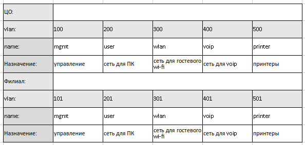
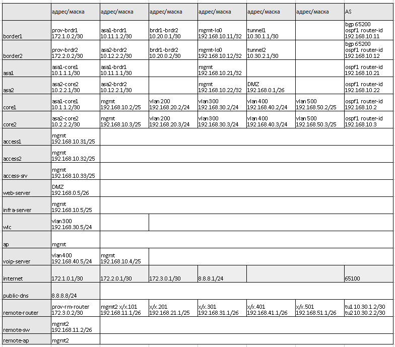

# Дипломная работа по курсу "Сетевой инженер" - Лебедев Д.С.

[PKT файл задания](files/DIP.NTW26.pkt)  
Конфигурационные файлы **/files/configs**

---
**[Задание на проектирование](README.md)**  
**[Результаты тестирования](DIP.NTW26.02.TEST.md)**

---
## Пояснительная записка

В соответствии с заданием настроена отказоустойчивая связка RSTP+HSRP на уровне доступ-ядро, настроено централизованное назначение сетевых настроек для оконечных устройств.
Организованы:
- беспроводной гостевой доступ к сети интернет;
- отказоустойчивая маршрутизация в сети компании;
- доступ к сети интернет по протоколу BGP;
- сервис VoIP внутри компании.
Настроены сервисы централизованной аутентификации, синхронизации времени и логирования сетевых устройств.

В центральном офисе и филиале для сегментации сети по функциональному признаку организованы следующие VLAN:



Адреса и подсети распределены согласно таблицы: 



В соответствии с заданием для отдельных функциональных групп ограничен или разрешен доступ:
- Пользователи ПК (проводные) ЦО имеют выход в интернет и доступ к принтерам и web-серверу в DMZ. Организовано с помощью ACL на коммутаторах ядра.
- Гостевой доступ по Wi-Fi. Разрешен доступ только в интернет. Организовано с помощью ACL на коммутаторах ядра (ЦО), маршрутизаторе филиала.
- Подсети ip-телефонии ЦО и филиала. Разрешен доступ только в голосовую подсеть ЦО и филиала. Организовано с помощью ACL на коммутаторах ядра (ЦО), маршрутизаторе филиала.
- Принтеры ЦО и филиала. Разрешен доступ только к проводным пользователям ПК и филиала. Организовано с помощью ACL на коммутаторах ядра (ЦО), маршрутизаторе филиала.
- Пользователи ПК филиала (проводные). Имеют доступ к принтерам и web-серверу в DMZ, не имеют доступа в интернет. Организовано с помощью ACL маршрутизаторе филиала.

Для организации общей сети центрального офиса и филиала используются Tunnel-интерфейсы GRE. Данное решение имеет следующие основные недостатки:

- Отсутствие шифрования: Данные передаются по сети в незашифрованном виде, что делает их доступными для перехвата.
- Отсутствие аутентификации: GRE не обеспечивает аутентификации, что делает его уязвимым для сетевых атак.
- Отсутствие поддержки IPv6.
- Низкая производительность. GRE может создавать дополнительную нагрузку на сеть.
- Отсутствие управления полосой пропускания: GRE не предоставляет средств управления полосой пропускания.
- GRE не поддерживает QoS, что может негативно повлиять на качество предоставляемых услуг.
- Устаревший протокол.

Альтернативы GRE:

* IPsec - обеспечивает аутентификацию, шифрование и управление полосой пропускания.
* SSL VPN - обеспечивает безопасное соединение между ЦО и филиалом с помощью шифрования SSL.
* WireGuard - VPN-протокол, отличается высокой скоростью и простотой настройки.
* OpenVPN - VPN-протокол, обеспечивает высокую степень безопасности и гибкость настройки.


---
## Доработка

Вопросы:

> 1. Почему с core1 svi обозначены как passive-interface а на core2 нет. Почему все passive interface кроме 100 вланы при этом соседство не обозначено

*A:* Обозначил все вланы, кроме 100, passive-interface на core1 и core2. Изначально заметил, что CPT с passive-interface на SVI тупит меньше (возможно, это субъективно). Vlan100 оставлен для установки соседства между core. Можно, конечно, сделать отдельный vlan, стыковочный.

```sh
core1(config)#do sh ip os nei


Neighbor ID     Pri   State           Dead Time   Address         Interface
192.168.10.21     1   FULL/DR         00:00:37    10.1.1.1        GigabitEthernet0/1  //asa1
192.168.10.3      1   FULL/DR         00:00:37    192.168.10.3    Vlan100             //core2

core1(config)#do sh ip rou os
     10.0.0.0/30 is subnetted, 4 subnets
O       10.2.2.0 [110/2] via 192.168.10.3, 00:4294967295:4294967288, Vlan100
O       10.11.1.0 [110/2] via 10.1.1.1, 00:4294967295:4294967288, GigabitEthernet0/1
O       10.12.2.0 [110/3] via 192.168.10.3, 00:4294967295:4294967288, Vlan100
     192.168.0.0/26 is subnetted, 1 subnets
O       192.168.0.0 [110/3] via 192.168.10.3, 00:4294967295:4294967288, Vlan100
     192.168.10.0/24 is variably subnetted, 3 subnets, 2 masks
O       192.168.10.11 [110/3] via 10.1.1.1, 00:4294967295:4294967288, GigabitEthernet0/1
O       192.168.10.12 [110/4] via 192.168.10.3, 00:4294967295:4294967288, Vlan100
O*IA 0.0.0.0/0 [110/3] via 10.1.1.1, 00:4294967295:4294967288, GigabitEthernet0/1

```

> 2. Зачем остановились в назначении типов зонам? Давайте тогда area2 как nssa назначим?

*A:* При назначении nssa area 2 на бордерах ЦО сразу появляется рекурсия в туннелях. Баг CPT.

Замечания:

> 1. Зачем на ремоут роутере в филиале у вас обозначена area1? Он же вообще в area1 не входит

*A:* Исправлено.

> 2. На роутере в филиале настроен статический дефолтный маршрут и НАТ. Доступа в интернет по ТЗ из филиала нет. Так что дефолт роут статический удаляем прописываем специфические маршруты до стыковочных сетей ЦО с провайдером, чтобы туннели поднялись и нат выпиливаем

*A:* Маршруты прописаны, NAT удален

> 2. Да ASA не настроены практически надо донастроить - но это вы и сами указали в остальном - ок.

- class-map, policy-map, service policy перебрал
- security-level присвоены интерфейсам в соответствии с зонами

Должно работать с такими настройками:
```
=== core1 ===

access-list INSIDE extended permit ip any any
access-list INSIDE extended permit tcp any any
access-list INSIDE extended permit icmp any any
access-list INSIDE extended permit udp any any
access-list OUTSIDE extended permit ip 192.168.0.0 255.255.0.0 any
access-list OUTSIDE extended permit ip 172.16.0.0 255.255.0.0 any
access-list OUTSIDE extended permit ip 10.0.0.0 255.0.0.0 any
!
!
access-group INSIDE in interface INSIDE
access-group OUTSIDE in interface OUTSIDE

=== core2 ===

access-list INSIDE extended permit ip any any
access-list INSIDE extended permit tcp any any
access-list INSIDE extended permit icmp any any
access-list INSIDE extended permit udp any any
access-list OUTSIDE extended permit ip 192.168.0.0 255.255.0.0 any
access-list OUTSIDE extended permit ip 172.16.0.0 255.255.0.0 any
access-list OUTSIDE extended permit ip 10.0.0.0 255.0.0.0 any
access-list OUTSIDE extended permit tcp any host 192.168.0.5 eq www
access-list DMZ extended deny ip 192.168.0.0 255.255.0.0 any
access-list DMZ extended deny ip 172.16.0.0 255.255.0.0 any
access-list DMZ extended deny ip 10.0.0.0 255.0.0.0 any
access-list DMZ extended permit ip any any
!
!
access-group INSIDE in interface INSIDE
access-group OUTSIDE in interface OUTSIDE
access-group DMZ in interface DMZ
```

но, по факту, работает только при ACL на OUTSIDE.
- Если вешать что-то на INSIDE, перестает пинговаться интернет.
- Если на DMZ, перестает открываться сайт в DMZ из интернета.