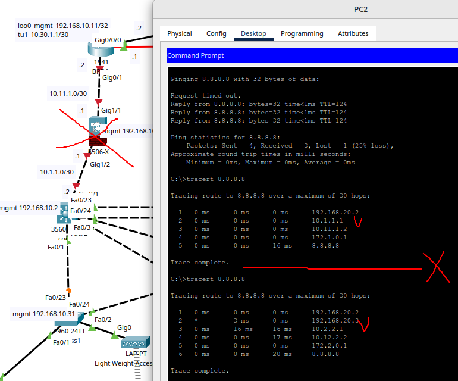

# Дипломная работа по курсу "Сетевой инженер" - Лебедев Д.С.
## Результаты тестирования

---
1. Проверка STP, HSRP. Роль Root bridge и HSRP-active на одном устройстве. Команды: show spanning-tree, show standby на этом устройстве.

Вывод команд в прикрепленном [файле](_att/03.dip_test01-01.txt)

2. Проверка маршрутизации на коммутаторах ядра. Show ip route. Должен присутствовать маршрут по умолчанию и маршруты до интерфейсов ASA и бордеров.

3. Проверка LAG на коммутаторах ядра show etherchannel summary.

4. Маршрутизация на бордерах sh ip route. В таблице маршрутизации должны присутствовать bgp-маршруты от провайдера, ospf-маршруты до внутренних подсетей ЦО и филиала.

5. Туннель CAPWAP на БЛВС ТД в статусе Connected, с ноутбуков есть связь с 8.8.8.8.

6. Телефонные аппараты зарегистрированы на VoIP сервере, прозвон с одного на другой работает.

7. На все сетевые устройства можно попасть по учётной записи tacacs+ сервера.

8. Время на устройствах синхронизировано. Show ntp status.

9. С 8.8.8.8 есть доступ к web-серверу в DMZ. Обратный доступ тоже есть. Проверять доступ необходимо браузером.

10. Отключение одного из каналов связи не приводит к потере доступа в интернет с пользовательских ПК(ping до сервера 8.8.8.8).

11. Выход из строя одного из коммутаторов ядра, межсетевого экрана или бордер роутера не приводит к потере доступа в интернет с пользовательских ПК(ping до сервера 8.8.8.8). Потеря доступа к web-серверу извне допускается.

12. Ноутбуки не имеют доступа к внутренним сетям компании(ping svi users, mgmt, printer).

13. Устройства филиала имеют доступ только к внутренним сетям компании, не имеют выхода в интернет.

