# Дипломная работа по курсу "Сетевой инженер" - Лебедев Д.С.

[Пояснительная записка](DIP.NTW26.01.NOTE.md)  
[Результаты тестирования](DIP.NTW26.02.TEST.md)

---
## [Задание на проектирование](https://github.com/netology-code/ntw-diplom?tab=readme-ov-file)
### Цель дипломной работы

В результате выполнения этого задания вы научитесь настраивать хорошо масштабируемую отказоустойчивую и защищённую сеть, выделяя для каждого пользовательского сервиса уникальные права и пропускную полосу. Также вы научитесь объединять разрозненные филиальные сети компании в одну единую. Для удобства администрирования вы научитесь интегрировать инструменты централизованной аутентификации и логирования в настроенную вами сеть.

1.  Настроить отказоустойчивую связку RSTP+HSRP на уровне доступ-ядро.
2.  Подготовить безопасное централизованное назначение сетевых настроек для оконечных устройств.
3.  Организовать централизованный беспроводной гостевой доступ к сети интернет.
4.  Организовать отказоустойчивую маршрутизацию в сети компании.
5.  Организовать отказоустойчивый доступ к сети интернет по протоколу BGP.
6.  Развернуть сервис VoIP внутри компании.
7.  Настроить сервисы централизованной аутентификации, синхронизации времени и логирования сетевых устройств.
8.  Настроить сеть компании полностью "под ключ".

### Чек-лист готовности к выполнению дипломной работы

Для выполнения работ потребуется:

1.  Понимание протоколов маршрутизации eBGP, OSPF.
2.  Понимание предсказуемного поведения протоколов RSTP, HSRP, LAG.
3.  Знание протоколов безопасного подключения к уровню доступа (vlan, trunk, portfast, bpduguard, dhcp-snooping)
4.  Умение настраивать туннельный протокол GRE.
5.  Умение настраивать Qos для голосового трафика внутри GRE.
6.  Знание aaa, tacacs+, NTP, syslog.
7.  Умение настраивать устройства беспроводной сети: AP, WLC.
8.  Умение настраивать внутреннюю voip-телефонию.
9.  Знание особенностей настройки межсетевого экранирования на Cisco ASA.
10.  Умение настраивать static NAT, PAT overload.

___
## Задание

Нужно настроить отказоустойчивую, безопасную, масштабируемую сеть и запустить на ней пользовательские сервисы.

### Этапы выполнения

1.  Соберите топологию сети в Cisco Packet tracer. Модели сетевого оборудования:
    
    -   border-router - 1941,
    -   fw - ASA 5506-x,
    -   ядро - 3560-24,
    -   доступ - 2960-24,
    -   wlan - WLC-2504,
    -   3702i AP,
    -   internet - switch 3650,
    -   VOIP-server - router 2811,
    -   ip-phone 7960.
    
Используйте за основу [шаблон топологии](_att/ntw_topology_8.2.2.pkt), в котором уже есть оборудование, настройки которого изменять нельзя.

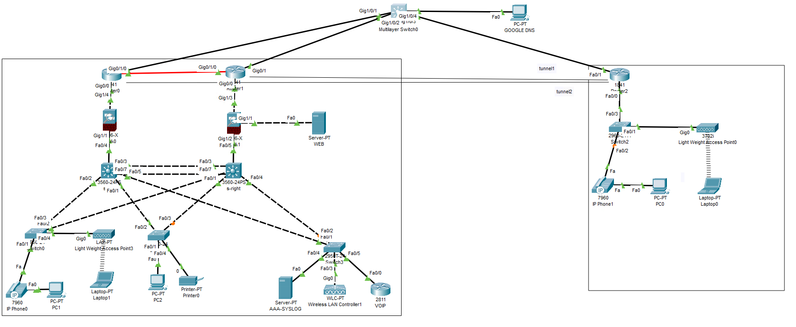
    
2.  Заполните [таблицу распределения подсетей и адресов](_att/ip-address-table.xlsx) (по примеру коммутатора "internet").

Нужно учёсть возможность добавления пяти новых коммутаторов доступа в ЦО, и открытия трёх новых филиалов:

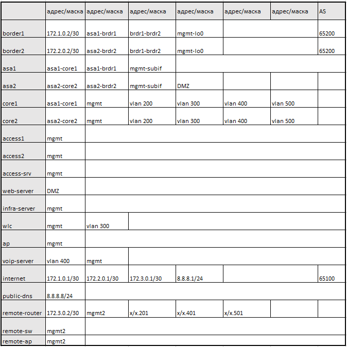
    
3.  Настройте на коммутаторах доступа порты для подключения пользовательских устройств и аплинки. Также на пользовательских портах коммутатора следует настроить:
    
    -   port-security на 3 адреса,
    -   dhcp-snooping,
    -   portfast,
    -   RSTP.

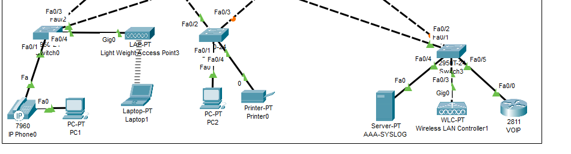

4.  Настройте на коммутаторах ядра:
    
    -   vlan,
    -   LAG,
    -   RSTP,
    -   SVI,
    -   dhcp-relay
    -   HSRP для всех vlan.
    
    На этом шаге проверьте работу stp, lag.
    
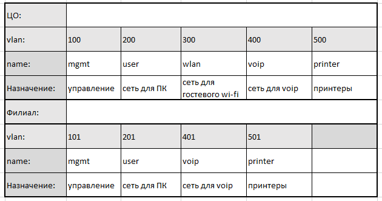

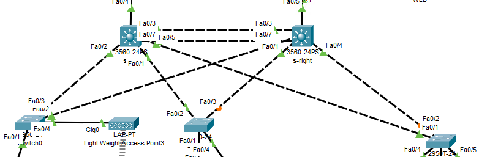

5.  Настройте сервисы для распределения сетевых настроек для пользовательских устройств. Так как сервер находится в отдельной сети, на SVI настраивается helper. По окончанию настроек dhcp-сервер должен раздать настройки PC, телефонам и принтерам, с любого хоста ЦО должен быть доступен любой другой хост.

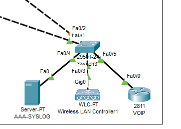
    
6.  Настройте сервис БЛВС. Точки доступа должны подключаться к контроллеру, который сообщит им настройки по capwap. Подключите ноутбук к ТД, проверьте связность сети. 

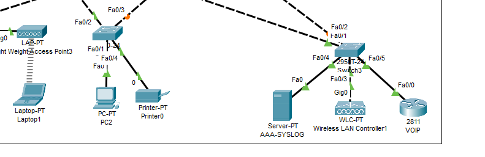
    
7.  На коммутаторах ядра запустите протокол маршрутизации ospf. Он должен анонсировать все внутренние сети в зоне 1.

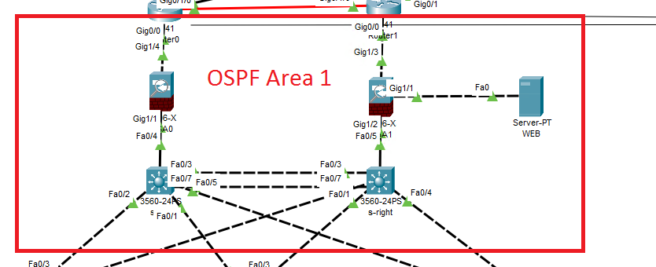
    
8.  На каждом межсетевом экране настройте адресацию и три зоны: inside, outside, DMZ.
    
    Правила фильтрации:
    
    -   из inside доступ свободный во все зоны
    -   из outside в inside и DMZ доступ разрешен для траффика от приватных адресов
    -   из DMZ разрешен доступ только в outside на публичные адреса

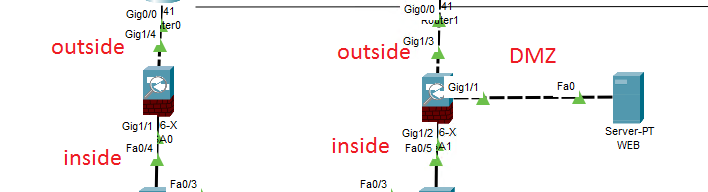

9.  На Cisco ASA настройте протокол ospf. МСЭ должен принимать и анонсировать все сети в зоне 1.  
    Настройте web-сервер, подключенный в DMZ зону одной из ASA.
    
    На этом шаге проверьте:
    
    -   все ли сети получены
    -   все ли сети анонсируются на коммутаторы ядра
    -   есть ли доступ к web-серверу и с него
10.  Настройте пограничные маршрутизаторы. Настройте адресацию и проверьте сетевую связность внутри ЛВС и доступность шлюза провайдера.
    
11.  Настройте маршрутизацию ospf:
    

-   интерфейсы в сторону ASA в зоне 1
    
-   между собой в зоне 0
    
    Настройте анонс маршрута 0.0.0.0/0 во внутреннюю сеть с разными метриками для резервирования подключения. Другие маршруты с бордеров во внутреннюю сеть не должны анонсироваться. Проверьте получение и анонс маршрутов.

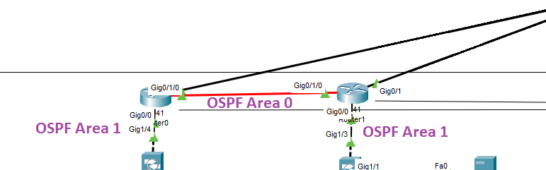

12.  Настройте ebgp-сессии с оборудованием провайдера. Проверьте получение и анонс маршрутов.

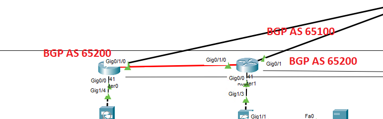
    
13.  Настройте правила NAT,PAT на пограничных маршрутизаторах.
    
14.  Настройте маршрутизатор филиала: адресацию, статический маршрут до роутеров ЦО через провайдера. Проверьте связность с внешними интерфейсами бордеров ЦО.  

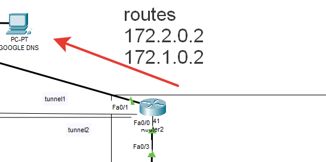
    
15. На маршрутизаторе филиала настройте Tunnel-интерфейсы gre до бордеров ЦО. А так же протокол ospf для получения и анонса внутренних сетей. Туннельные интерфейсы в зоне 2.

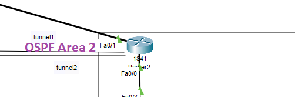
    
16.  Настройте коммутатор доступа филиала для подключения к сети ip-телефона, ПК и точки доступа. На маршрутизаторе настройте helper для централизованного получения сетевых настроек оконечными устройствами.

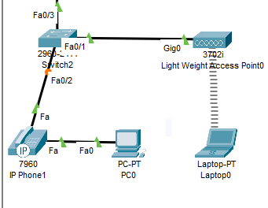
    
17.  Настройте БЛВС ТД филиала, подключить к ней ноутбук. Проверьте сетевую связность.
    
18.  Настройте на АСО интерфейсы для управления. Настройте на них аутентификацию по tacacs+, синхронизацию часов(NTP) с сервером и отправку логов по syslog(на ASA настройка aaa и syslog не требуется, достаточно локальной учётной записи).
    
19.  Настройте ip-телефоны, проверьте дозвон.
    
Кратко опишите, чем чреват выбор протокола GRE для объединения сети ЦО и филиала в 15 пункте. Какие более безопасные альтернативы можно предложить без потери функциональности?

### Тестирование

1.  Проверка STP, HSRP. Роль Root bridge и HSRP-active на одном устройстве. Команды: show spanning-tree, show standby на этом устройстве.
2.  Проверка маршрутизации на коммутаторах ядра. Show ip route. Должен присутствовать маршрут по-умолчанию и маршруты до интерфейсов ASA и бордеров.
3.  Проверка LAG на коммутаторах ядра show etherchannel summary.
4.  Маршрутизация на бордерах sh ip route. В таблице маршрутизации должны присутствовать bgp-маршруты от провайдера, ospf-маршруты до внутренних подсетей ЦО и филиала.
5.  Туннель CAPWAP на БЛВС ТД в статусе Connected, с ноутбуков есть связь с 8.8.8.8.
6.  Телефонные аппараты зарегестрированы на VoIP сервере, прозвон с одного на другой работает.
7.  На все сетевые устройства можно попасть по учётной записи tacacs+ сервера.
8.  Время на устройствах синхронизировано. Show ntp status.
9.  С 8.8.8.8 есть доступ к web-серверу в DMZ. Обратный доступ тоже есть. Проверять доступ необходимо браузером.
10.  Отключение одного из каналов связи не приводит к потере доступа в интернет с пользовательских ПК(ping до сервера 8.8.8.8).
11.  Выход из строя одного из коммутаторов ядра, межсетевого экрана или бордер роутера не приводит к потере доступа в интернет с пользовательских ПК(ping до сервера 8.8.8.8). Потеря доступа к web-серверу извне доспускается.
12.  Ноутбуки не имеют доступа к внутренним сетям компании(ping svi users, mgmt, printer).
13.  Устройства филиала имеют доступ только к внутренним сетям компании, не имеют выхода в интернет.

ПРИМЕЧАНИЯ: В связи с особенностью эмулятора Packet Tracer, часто бывает так, что для того, чтобы тест заработал, нужно перезагрузить устройства. Для корректной работы statefull инспекции протокола icmp необходимо удалить стандартные настройки инспекции на Cisco ASA(class-map, policy-map, service policy) и создать собственные под другими названиями.

___
### Правила приема дипломной работы

В качестве выполненной работы прикрепите в личном кабинете файлы, содержащие следующую информацию:

-   Пояснительную записку, которая содержит таблицы и описания к решениям, указанным на всех этапах выполнения работ. Обоснование предполагает короткое описание (1-3 предложения) выбранного технического решения, которое должно ответить на вопрос, почему вы выбрали именно это решение, а не иное.
-   Собранную топологию в PacketTracer в виде. pkt файла.
-   Конфигурационные файлы с оборудования.
-   Результаты тестирования, проведенного на шаге "Тестирование", в виде отдельного текстового файла с вложенными в него скриншотами и трассировками.

### Критерии оценки проекта

1.  Зачёт:
    -   Топология построена корректно.
    -   Адреса и подсети распределены с учётом размера сети и возможного масштабирования.
    -   Все тесты пройдены успешно.
Допускается не более 3 ошибок в тестах и двух ошибок в выделении подсетей.
    
2.  Незачёт:
       -   Ошибки в выделении адресов, подсетей и масок, более трёх тестов не пройдено.